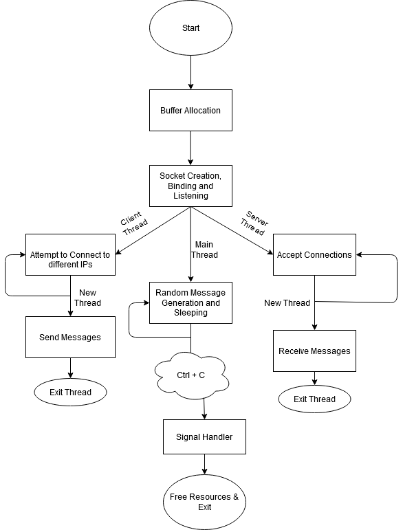

# Real Time Sockets Application for embedded devices

## Project Information

Using a *Raspberry Pi* Zero, our goal was to create a *C* application that uses *sockets* and *threads* and can interact with other *Raspberry Pi*'s exchanging messages.

More specifically, by using the same *SSID* network, the devices will belong to the same network and can be searched using their gateway private IP. 

Α client/server design was implemented on the **same** device. As a client, each device was searching for new connections whereas as a server, it accepted new connections. Every incoming and outgoing connection was handled by a new spawned *thread*. After the establishment of each connection, messages were exchanged and saved in a circular buffer. The general network was a *Peer-To-Peer architecture*.

The design of my implementation is shown in the following flow chart

